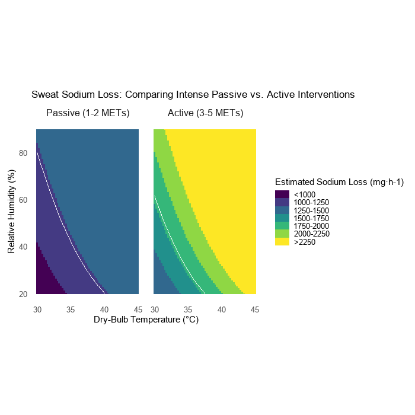

# Sweat Sodium Loss Heatmap

Companion code for:

> Hoch JW, Watso JC. Can We Protect Our Hearts by Sweating Out Excess Sodium? *Exerc Sport Sci Rev.* 2026 Feb 19. Online ahead of print. PMID: 41718617.

## Overview

This script models estimated sweat sodium loss (mg·h-1) across a range of dry-bulb temperatures (30–45°C) and relative humidity conditions (20–90%) for two intervention types:

- **Passive (1–2 METs)** — sauna or hot water immersion
- **Active (3–5 METs)** — moderate aerobic exercise

Sweat rate models are anchored to empirical data (passive: 1.0–1.5 L·h-1; active: 1.5–2.5 L·h-1) and assume a population-average sweat sodium concentration of 40 mmol·L-1 (~920 mg·L-1). A Wet Bulb Globe Temperature (WBGT) contour is overlaid on each panel to indicate the environmental threshold for each activity level.

## Output



## Scaling for Individual Sweat [Na+]

The figure assumes 40 mmol/L. To adjust:

| Sweat [Na+] | Multiply values by |
|---|---|
| 20 mmol/L | 0.5 |
| 30 mmol/L | 0.75 |
| 40 mmol/L | 1.0 (as shown) |
| 50 mmol/L | 1.25 |
| 60 mmol/L | 1.5 |
| 70 mmol/L | 1.75 |
| 80 mmol/L | 2.0 |

## References
The modeling and environmental thresholds in this script are based on the following research:

* **Passive Heat Responses:** Atencio JK, et al. (2025). *Comparison of thermoregulatory, cardiovascular, and immune responses...* Am J Physiol Regul Integr Comp Physiol.
* **Environmental Limits (PSU HEAT Project):** Vecellio DJ, et al. (2022). *Utility of the Heat Index...* Int J Biometeorol.
* **Wet-Bulb Thresholds:** Vecellio DJ, et al. (2022). *Evaluating the 35°C wet-bulb temperature adaptability threshold...* J Appl Physiol.

## Installation

```r
install.packages(c("ggplot2", "dplyr", "tidyr", "viridisLite", "showtext"))
```

## Usage

```r
source("sweat_sodium_loss.R")
```

Output is saved to `images/Rplot04.png` at 300 DPI.

## Requirements

See `requirements.txt`.

## License

MIT
